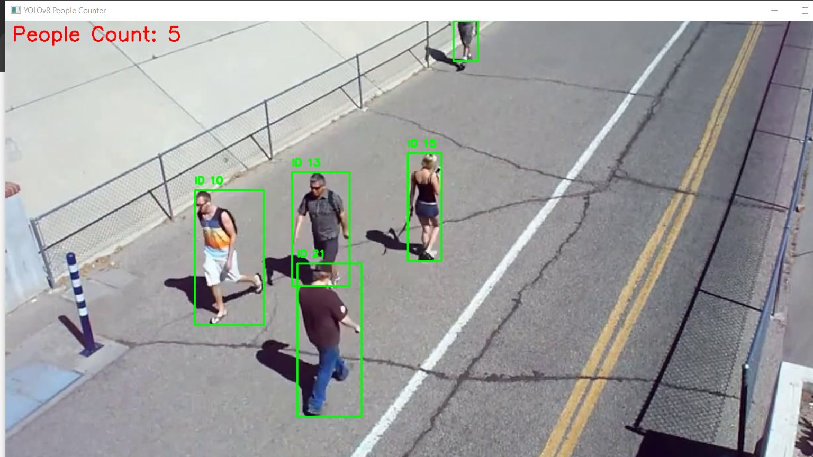

# 👥 People Counter Using YOLOv8

## 📄 Project Overview

This project is an AI-powered **People Counter** that detects and counts people in a video using **YOLOv8** object detection. The system processes video files and outputs a CSV report with the detected number of people in each frame. It also displays the video with bounding boxes and person IDs.

## ✨ Features

- **Detects and counts people** in a given video.
- **Tracks people across frames** to avoid duplicate counting.
- **Exports results to a CSV file** for further analysis.
- **Utilizes GPU acceleration** for faster inference (if available).
- **Customizable settings via `.env` file**.

## 🛠️ Technologies Used

- **YOLOv8** – Object detection and person recognition.
- **OpenCV** – Video processing and visualization.
- **PyTorch** – Model inference acceleration.
- **Pandas** – CSV data management.
- **NumPy** – Numerical computations.
- **dotenv** – Managing environment variables.

## 🚀 How to Run the Project

### 1️⃣ Clone the Repository

```sh
git clone https://github.com/plavsic-marko/people-counter.git
cd people-counter
```

### 2️⃣ Create a Virtual Environment

```sh
python -m venv venv
```

### 3️⃣ Activate the Virtual Environment

**Windows:**

```sh
venv\Scripts\activate
```

**Linux/Mac:**

```sh
source venv/bin/activate
```

### 4️⃣ Install Dependencies

```sh
pip install -r requirements.txt
```

### 5️⃣ Configure `.env` File

Create a `.env` file in the project root and define the following settings:

```env
YOLO_MODEL="yolov8m.pt"
VIDEO_PATH="videos/sample.mp4"
CSV_OUTPUT_PATH="output/counts.csv"
IMGSZ=640
CONF_THRESHOLD=0.6
DEVICE="cuda"  # Set to "cpu" if no GPU available
```

### 6️⃣ Run the Application

```sh
python main.py
```

### 7️⃣ Open the Video Output

The application will display the video with **bounding boxes and person IDs**, while also logging detected counts to the terminal and saving them to the CSV file.

## 📊 Output

- The final result is saved as a **CSV file** at the path specified in `.env`.
- Example CSV structure:

```
Frame,People Count
1,3
2,5
3,4
TOTAL,10
```

## 🎨 User Interface



- Displays **real-time** detection results in a window.
- People count is shown in the **top-left corner in red**.
- Saves results for later review.

## 📚 Model Used

The application uses the **YOLOv8 Medium (yolov8m.pt)** model trained for **object detection**, including person recognition.

## 🧑‍💻 Contribution Guidelines

- **Fork** the repository.
- **Create a new branch** for your feature or bug fix.
- **Commit your changes**.
- **Submit a pull request**.

## 📄 License

This project is licensed under the **MIT License**.

## 💬 Contact

For any questions or feedback, feel free to reach out:

- **Email:** plavsicmarko10@gmail.com
- **GitHub:** https://github.com/plavsic-marko**.
